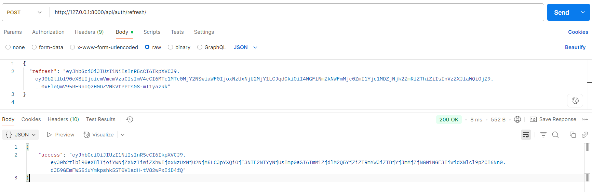
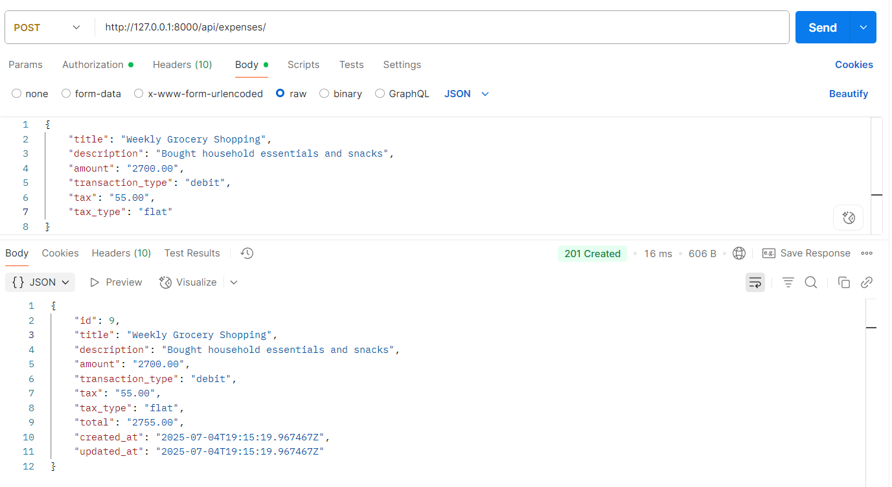
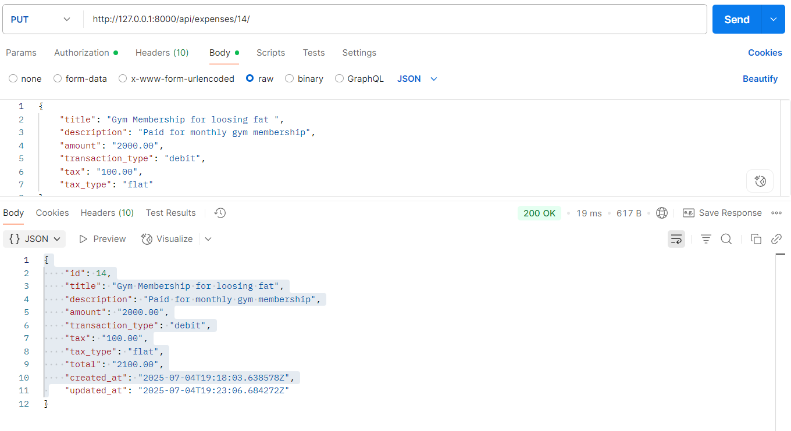
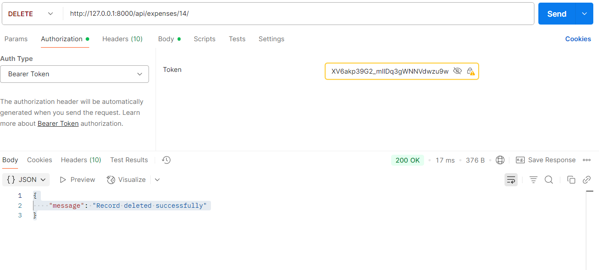

# MyMoneyLog

**MyMoneyLog** is a personal expense tracking web application built with Django and Django REST Framework. It allows users to log, manage, and monitor their daily expenses efficiently with user authentication and API endpoints.

---

## 🔍 Overview

The goal of this project is to provide users with a simple platform to:

- Register and authenticate
- Record their expenses
- Categorize and view their spending
- Interact with RESTful APIs

---

## 🚀 Features

- User Registration and Login
- JWT-based Authentication
- Add, Edit, and Delete Expense Entries
- API endpoints for integration with frontend/mobile
- Modular Django app structure (`users`, `expenses`)

---

## 🛠️ Tech Stack

- **Backend**: Django, Django REST Framework
- **Database**: SQLite (for development)
- **Auth**: JWT Authentication (via DRF)

---

## 🧰 Setup Instructions

### 1. Clone the Repository

```bash
git clone <repo-url>
cd MyMoneyLog
```

### 2. Create Virtual Environment

```bash
python -m venv env
source env/bin/activate  # On Windows use `env\Scripts\activate`
```

### 3. Install Dependencies

```bash
pip install -r requirements.txt
```

### 4. Apply Migrations

```bash
python manage.py migrate
```
### 5. Create a Superuser (Optional)

```bash
python manage.py createsuperuser
```
### 6. Run Development Server

```bash
python manage.py runserver
```

## 🧪 Usage

- Visit `http://127.0.0.1:8000/` to access the project.
- Use tools like **Postman** to interact with the API endpoints.
- Register/login to access user-specific expense logs.

---

## 📡 API Endpoints (Sample)

| Endpoint             | Method | Description            |
|----------------------|--------|------------------------|
| `/api/auth/register/`   | POST   | Register new users     |
| `/api/auth/login/`      | POST   | Authenticate users     |
| `/api/auth/refresh/`      | POST   | Refresh and obtain a new access token  |
| `/api/expenses/`         | GET    | List all expenses      |
| `/api/expenses/<id>/`         | GET    | Get specific expenses      |
| `/api/expenses/<id>/`    | PUT    | Update an expense      |
| `/api/expenses/<id>/`    | DELETE | Delete an expense      |

> **Note:** For authentication, include your token in the headers:  
> `Authorization: Token <your-token>`


## 📬 API Testing with Postman

### 🔐 User Registration (`/users/register/`)


---

### 🔑 User Login (`/users/login/`)


---

### 🔄 Refresh Token (`/users/auth/refresh/`)




---

### ➕ Add New Expense (`/expenses/` – POST)




---

### 📥 Get All Expenses (`/expenses/` – GET)


---

### 📄 Get Single Expense (`/expenses/<id>/` – GET)


> 📌 Example: `GET /expenses/3/` to retrieve the expense with ID 3.

---

### ✏️ Update Expense (`/expenses/<id>/` – PUT)




---

### ❌ Delete Expense (`/expenses/<id>/` – DELETE)



> 📌 Example: `DELETE /expenses/3/` to delete the expense with ID 3.


---

## 📁 Project Structure

```bash
MyMoneyLog/
│
├── expenses/           # Expense tracking app
├── users/              # User authentication app
├── MyMoneyLog/         # Main Django project config
├── requirements.txt    # Python dependencies
├── manage.py           # Django management script
